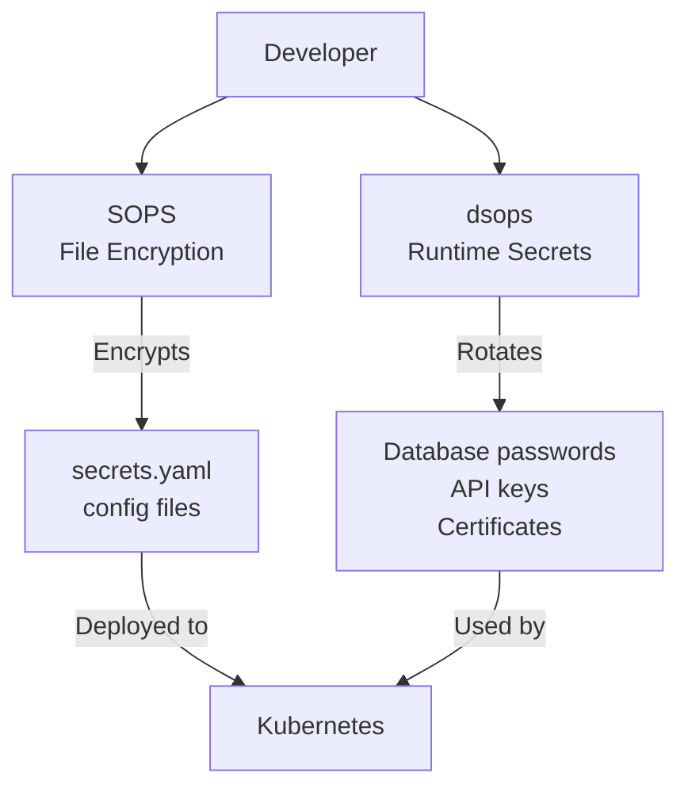
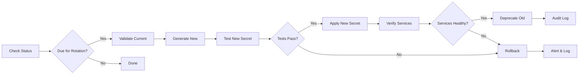

# VISION_ROTATE.md - Secret Rotation Vision for dsops

## Executive Summary

dsops extends beyond secret retrieval to become the industry-standard tool for **automated secret value rotation**. While SOPS excels at encrypting files and rotating encryption keys, dsops addresses a complementary but distinct gap: rotating the actual secret values themselves (passwords, API keys, certificates) in a safe, automated, and auditable manner.

## Problem Statement

### Current State of Secret Rotation

1. **Manual Process**: Most organizations rotate secrets manually, leading to:
   - Human error and security incidents
   - Inconsistent rotation schedules
   - Lengthy, error-prone runbooks
   - "We'll rotate it next quarter" syndrome

2. **Tool Fragmentation**: Teams use different tools for different secret types:
   - Database passwords: Custom scripts
   - API keys: Provider-specific consoles
   - Certificates: Certbot/ACME clients
   - Cloud credentials: Cloud-specific CLIs

3. **Lack of Visibility**: Organizations struggle to answer:
   - When was this secret last rotated?
   - Which secrets are overdue for rotation?
   - Who has access to rotation capabilities?
   - What happens if rotation fails?

4. **Compliance Challenges**:
   - PCI-DSS, SOC2, HIPAA require regular rotation
   - No unified way to prove compliance
   - Audit trails scattered across systems

### Why dsops?

dsops is uniquely positioned to solve secret rotation because:

1. **Already Has Provider Integrations**: Existing connections to AWS, GCP, Azure, Vault, password managers
2. **Understands Secret Context**: Knows what each secret is used for via environment configuration
3. **Developer-First Design**: Makes rotation accessible to developers, not just SREs
4. **Ephemeral-First Philosophy**: Aligns with modern, secure secret handling practices
5. **Complementary to SOPS**: Works alongside SOPS rather than competing - SOPS handles file encryption, dsops handles runtime secret rotation

## Vision

### Core Principle

> "Secret rotation should be as simple as `dsops rotate` and as reliable as `git commit`"

### Design Philosophy

1. **Safe by Default**: Every rotation includes verification, rollback capabilities, and gradual rollout
2. **Strategy-Aware**: Understands different secret types require different rotation approaches
3. **Observable**: Full visibility into rotation status, history, and health
4. **Composable**: Integrate with existing CI/CD, monitoring, and incident response tools
5. **Auditable**: Complete audit trail for compliance and security reviews

## Scope and Positioning

### What dsops Rotates (In Scope)
- **Database passwords**: ALTER USER commands, connection string updates
- **API keys**: Provider-specific rotation APIs (Stripe, GitHub, etc.)
- **Application secrets**: JWT signing keys, session secrets, encryption keys used by applications
- **Certificates**: ACME/Let's Encrypt, Venafi, self-signed certificate renewal
- **OAuth credentials**: Client secrets, refresh tokens
- **Cloud credentials**: IAM access keys, service account keys

### What dsops Does NOT Rotate (Out of Scope)
- **File encryption keys**: Use SOPS for .yaml/.json file encryption key rotation
- **Git repository encryption**: Use SOPS `rotate` and `updatekeys` commands
- **Disk encryption keys**: Use OS/cloud provider tools
- **Database encryption keys**: Use database-native TDE key rotation

### Complementary Tool Relationships



**Integration Example**:
```bash
# GitOps workflow combining both tools
sops rotate secrets.yaml                    # Rotate file encryption keys
git add secrets.yaml && git commit -m "Rotate encryption keys"

dsops rotate --env production --all         # Rotate actual secret values
# Kubernetes pods automatically get updated secrets
```

## Architecture

### Data-Driven Service Architecture

dsops uses a **data-driven architecture** where service definitions, rotation strategies, and operational patterns are defined in the **[dsops-data](https://github.com/systmms/dsops-data)** community repository rather than hardcoded in Go implementations.

For terminology and architectural concepts, see [TERMINOLOGY.md](docs/TERMINOLOGY.md) which defines the distinction between secret stores (where secrets are stored) and services (what uses secrets and supports rotation).

The dsops-data repository currently contains **84+ validated service definition files** across major providers:
- **PostgreSQL**: 3 instances, 8 policies, 15 principals
- **Stripe**: 3 instances, 12 policies, 25 principals  
- **GitHub**: 2 instances, 3 policies, 2 principals
- **AWS IAM**: 3 instances, 8 policies, 7 principals
- **Google Cloud IAM**: 9 instances, 6 policies, 7 principals
- **Azure AD**: 3 instances, 15 policies, 6 principals
- **HashiCorp Vault**: 3 instances, 12 policies, 1 principal
- **MySQL**: 3 instances, 8 policies, 9 principals

```yaml
# Example: PostgreSQL service type from dsops-data
apiVersion: dsops.io/v1
kind: ServiceType
metadata:
  name: postgresql
  category: database
spec:
  credentialKinds:
    - name: db_password
      capabilities: [create, verify, rotate, revoke]
      constraints:
        maxActive: unlimited
        ttl: "90d"
        format: "^[A-Za-z0-9!@#$%^&*()_+\\-=\\[\\]{};':\"\\\\|,.<>\\?]{12,64}$"
    - name: connection_string
      capabilities: [create, verify, rotate]
      constraints:
        maxActive: 2  # Allow overlap during rotation
  defaults:
    rateLimit: low
    rotationStrategy: two-key
```

#### Benefits of Data-Driven Approach

1. **Community-Driven**: Service definitions maintained by the community
2. **Scalable**: Support hundreds of services without hardcoded implementations  
3. **Versioned**: Service capabilities evolve through structured releases
4. **Validated**: JSON schema validation ensures consistency
5. **Discoverable**: `dsops list services` shows available integrations

#### Service Component Types

```yaml
# dsops-data provides four types of definitions:
service-types/        # Generic service capabilities (what can be rotated)
service-instances/    # Specific deployment configurations
rotation-policies/    # How rotation should be performed  
principals/          # Who can perform operations
```

### Rotation Lifecycle



### Configuration Schema

```yaml
# dsops.yaml with data-driven service rotation
version: 1

secretStores:
  aws-prod:
    type: aws.secretsmanager
    region: us-east-1
    
  vault-prod:
    type: vault
    address: https://vault.company.com
    
  1password-ops:
    type: onepassword
    vault: Operations

services:
  postgres-prod:
    type: postgresql
    host: prod-db.company.com
    port: 5432
    database: app_production
    admin_store: store://aws-prod/database/admin
    
  stripe-prod:
    type: stripe
    environment: live
    
  github-ci:
    type: github
    org: company

rotation:
  dataDir: ./dsops-data  # Load service definitions and policies
  defaults:
    schedule: "0 2 * * 0"  # Weekly at 2 AM Sunday
    grace_period: 24h
    notification: slack://security-ops

envs:
  production:
    # Database with service-based rotation using dsops-data
    DATABASE_URL:
      from:
        store: store://aws-prod/rds/primary/connection_string
        service: svc://postgres-prod?kind=connection_string
      rotation:
        policy: pg-app-user-rotation  # From dsops-data
        schedule: "0 2 * * 0"  # Weekly
          
    # API key with service-based rotation using dsops-data
    STRIPE_SECRET_KEY:
      from:
        store: store://vault-prod/stripe/secret_key
        service: svc://stripe-prod?kind=secret_key
      rotation:
        policy: stripe-secret-key-rotation  # From dsops-data
        schedule: "0 0 1 * *"  # Monthly
          
    # Certificate with service-based rotation
    TLS_CERTIFICATE:
      from:
        store: store://aws-prod/certificates/api
        service: svc://letsencrypt-acme?kind=tls_certificate
      rotation:
        policy: acme-certificate-rotation  # From dsops-data
        schedule: "0 0 */60 * *"  # Every 60 days
          
    # GitHub PAT rotation using service definitions
    GITHUB_TOKEN:
      from:
        store: store://1password-ops/github/ci-token
        service: svc://github-ci?kind=pat
      rotation:
        policy: gh-ci-pats  # From dsops-data
        schedule: "0 0 1 */3 *"  # Quarterly
          
    # Legacy system with custom script strategy
    LEGACY_SYSTEM_TOKEN:
      from:
        store: store://1password-ops/legacy/token
      rotation:
        strategy: script  # Built-in strategy
        schedule: "0 0 1 */3 *"  # Quarterly
        config:
          script_path: ./scripts/rotate-legacy.sh
          timeout: 300s
```

## Features

### 1. Secret Value Rotation Commands

```bash
# Rotate specific secret value (password, API key, etc.)
dsops rotate --env production --key DATABASE_PASSWORD

# Rotate all secret values due for rotation  
dsops rotate --env production --all

# Dry run to see what would be rotated
dsops rotate --env production --dry-run

# Force rotation regardless of schedule
dsops rotate --env production --key API_KEY --force

# Service-based rotation using dsops-data definitions
dsops rotate --service svc://postgres/prod-db?kind=db_password \
  --policy pg-app-user-rotation

# GitHub PAT rotation with org-specific settings
dsops rotate --service svc://github/acme-org?kind=pat \
  --policy gh-ci-pats

# Stripe API key rotation using community policies  
dsops rotate --service svc://stripe/prod-account?kind=secret_key \
  --policy stripe-secret-key-rotation

# List available services from loaded dsops-data
dsops list services --type database --tag env:prod
dsops list services --type api-service --category payment
```

### 2. Status and Monitoring

```bash
# Check rotation status
dsops rotation status --env production

# Output:
SECRET                TYPE        LAST_ROTATED  NEXT_DUE    AGE    STATUS
DATABASE_URL          postgres    2024-01-15    2024-01-22  6d     ✅ Healthy
STRIPE_SECRET_KEY     api_key     2024-01-01    2024-02-01  20d    ✅ Healthy
TLS_CERTIFICATE       cert        2023-12-01    2024-01-30  51d    ⚠️  Due Soon
LEGACY_SYSTEM_TOKEN   custom      2023-10-01    2024-01-01  111d   ❌ Overdue
OAUTH_CLIENT_SECRET   oauth       2023-07-15    2024-01-15  189d   ❌ Overdue

# Get detailed rotation history
dsops rotation history --env production --key DATABASE_URL

# Monitor rotation health
dsops rotation health --env production --export prometheus
```

### 3. Compliance and Audit

```bash
# Generate compliance report
dsops rotation compliance --standard pci-dss --env production --export pdf

# Audit rotation events
dsops rotation audit --env production --days 90

# Enforce rotation policy
dsops rotation enforce --policy company-standard --env production
```

### 4. Integration Points

```yaml
# GitHub Actions
- name: Rotate Secrets
  uses: dsops/rotate-action@v1
  with:
    environment: production
    strategy: all-due
    
# Kubernetes CronJob
apiVersion: batch/v1
kind: CronJob
metadata:
  name: secret-rotation
spec:
  schedule: "0 2 * * 0"
  jobTemplate:
    spec:
      template:
        spec:
          containers:
          - name: dsops-rotate
            image: dsops/dsops:latest
            command: ["dsops", "rotate", "--env", "production", "--all"]
            
# Terraform
resource "dsops_rotation_policy" "production" {
  environment = "production"
  strategy    = "all-due"
  schedule    = "0 2 * * 0"
}
```

## Implementation Phases

### Phase 1: Core Rotation Engine (MVP)
- [ ] Rotation strategy interface
- [ ] Basic strategies: manual, random, webhook
- [ ] Rotation lifecycle management
- [ ] Audit logging
- [ ] Status and history commands

### Phase 2: Data-Driven Protocol Adapters
- [ ] Generic SQL protocol adapter (enables PostgreSQL, MySQL, SQL Server rotation via dsops-data)
- [ ] Generic NoSQL protocol adapter (enables MongoDB, Redis, DynamoDB rotation via dsops-data)
- [ ] Generic HTTP API protocol adapter (enables Stripe, GitHub, REST API rotation via dsops-data)
- [ ] Generic Certificate protocol adapter (enables ACME, Venafi, certificate rotation via dsops-data)
- [ ] Protocol routing engine (routes service operations to appropriate adapters)
- [ ] Service capability detection (auto-detect create/verify/rotate/revoke from dsops-data)

### Phase 3: Advanced Features
- [ ] Gradual rollout capabilities
- [ ] Service health verification
- [ ] Automatic rollback
- [ ] Notification integrations
- [ ] Compliance reporting

### Phase 4: Enterprise Features
- [ ] Custom rotation strategies
- [ ] Policy enforcement
- [ ] Multi-environment coordination
- [ ] Approval workflows
- [ ] Break-glass procedures

## Success Metrics

### Adoption Metrics
- Number of secrets under rotation management
- Reduction in manual rotation tasks
- Mean time to rotate (MTTR)
- Rotation success rate

### Security Metrics
- Average secret age
- Overdue rotation count
- Failed rotation recovery time
- Compliance audit pass rate

### Operational Metrics
- Rotation-related incidents
- Developer satisfaction scores
- Time saved vs manual rotation
- Integration adoption rate

## Risks and Mitigations

### Risk: Rotation Failures
**Mitigation**: 
- Comprehensive verification before deprecating old secrets
- Automatic rollback capabilities
- Grace periods for old secrets
- Clear alerting and escalation

### Risk: Service Disruption
**Mitigation**:
- Gradual rollout options
- Service health checks
- Maintenance window scheduling
- Dry-run capabilities

### Risk: Complexity
**Mitigation**:
- Start with simple strategies
- Excellent documentation
- Progressive disclosure of features
- Sane defaults

## Competition Analysis

### Existing Tools
1. **SOPS**: Excellent for file encryption key rotation, not runtime secret values
2. **HashiCorp Vault**: Has dynamic secrets but limited rotation strategies for existing secrets
3. **AWS Secrets Manager**: Lambda-based rotation, AWS-only, complex setup
4. **CyberArk**: Enterprise-focused, complex, expensive
5. **Custom Scripts**: Error-prone, no standardization

### dsops Advantages
1. **Complementary to SOPS**: Handles runtime secrets while SOPS handles file encryption
2. **Provider Agnostic**: Works across all secret stores (AWS, GCP, Azure, Vault, 1Password, etc.)
3. **Developer Friendly**: Simple CLI with safe defaults, not enterprise-only
4. **Strategy Library**: Pre-built rotation for common services (databases, APIs, certificates)
5. **Zero-Downtime**: Two-secret strategy eliminates service interruptions
6. **Open Source**: Extensible, auditable, community-driven

## Future Vision

### AI-Assisted Rotation
- Predict optimal rotation windows based on usage patterns
- Detect anomalous access patterns triggering rotation
- Generate rotation strategies for unknown secret types

### Zero-Downtime Rotation
- Blue-green secret deployment
- Automatic traffic shifting
- Real-time service impact analysis

### Rotation as Code
```hcl
# rotation.tf
rotation "production_database" {
  secret   = dsops_secret.database_password
  strategy = "postgres"
  
  schedule {
    cron = "0 2 * * 0"
    timezone = "UTC"
  }
  
  verification {
    connection_test = true
    query = "SELECT 1"
    timeout = "30s"
  }
  
  rollback {
    automatic = true
    grace_period = "1h"
  }
}
```

## Call to Action

Secret rotation is the most critical yet most neglected aspect of secret management. dsops can transform this from a dreaded quarterly task to an automated, reliable process. By building on the existing dsops foundation, we can deliver a solution that:

1. **Saves thousands of engineering hours** currently spent on manual rotation
2. **Prevents security incidents** from long-lived credentials
3. **Ensures compliance** with regulatory requirements
4. **Empowers developers** to own security without complexity

The path forward is clear: extend dsops from secret retrieval to complete secret lifecycle management, making rotation as routine and reliable as any other deployment process.