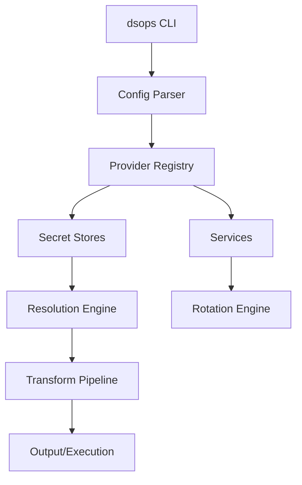

## Core Architecture

dsops is built with security and extensibility at its core:


  
    Key concepts and definitions used throughout dsops.
  
  
    How dsops keeps your secrets safe.
  
  
    The dsops-data repository and service definitions.
  


## Design Principles

1. **Ephemeral by Default**: Secrets never touch disk unless explicitly requested
2. **Provider Agnostic**: Clean abstraction between secret stores and services
3. **Fail Secure**: Any error results in no secret exposure
4. **Audit Everything**: Comprehensive logging with automatic redaction

## Component Overview

## Key Components

### Provider Interface
Unified interface for all secret stores and services, enabling consistent behavior across different backends.

### Resolution Engine
Handles dependency graphs, circular reference detection, and parallel resolution of secrets.

### Transform Pipeline
Composable transformations for secret values (base64, JSON extraction, templating).

### Rotation Engine
Manages the lifecycle of secret rotation with support for multiple strategies and rollback capabilities.