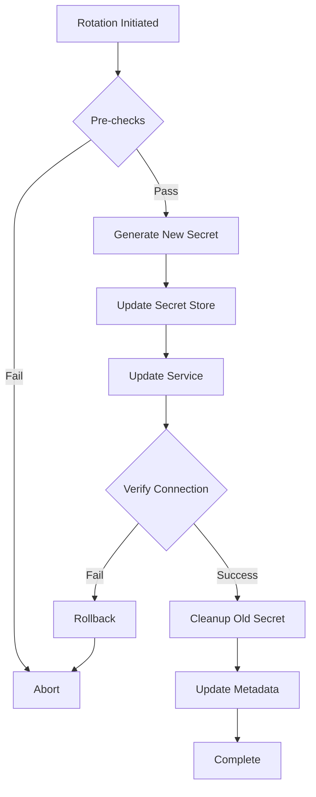

## Overview

The dsops rotation architecture is built on three key principles:

1. **Data-Driven**: Service definitions come from [dsops-data](https://github.com/systmms/dsops-data), not hardcoded implementations
2. **Protocol-Based**: Generic protocol adapters (SQL, HTTP API, etc.) handle actual rotation
3. **Pluggable**: New services are added through data files, not code changes

## Architecture Components

### 1. Service Definitions (dsops-data)

Service definitions describe what a service is and how to rotate its credentials:

```yaml
# dsops-data/providers/postgresql/service-type.yaml
name: postgresql
display_name: PostgreSQL Database
protocols: [sql]
capabilities:
  credential_kinds:
    - name: user_password
      display_name: User Password
      rotation_capable: true
      verification_capable: true
      fields:
        - name: username
          type: string
          required: true
        - name: password
          type: string
          required: true
          sensitive: true
```

### 2. Protocol Adapters

Protocol adapters implement the actual rotation logic for different service types:

```
┌─────────────────────────────────────────┐
│            Rotation Engine              │
├─────────────────────────────────────────┤
│         Protocol Adapter Layer          │
├─────────┬──────────┬──────────┬────────┤
│   SQL   │ HTTP API │  NoSQL   │  Cert  │
├─────────┼──────────┼──────────┼────────┤
│Postgres │ Stripe   │ MongoDB  │  ACME  │
│ MySQL   │ GitHub   │  Redis   │ Venafi │
│  MSSQL  │Datadog   │DynamoDB  │  etc.  │
└─────────┴──────────┴──────────┴────────┘
```

### 3. Rotation Strategies

Different strategies for different security requirements:

#### Immediate Rotation
```
Time →
Old: ████████X
New:         ████████████
     ↑
   Rotation Point (Brief Downtime)
```

#### Two-Key Rotation (Zero Downtime)
```
Time →
Key1: ████████████████████
Key2:         ████████████████████
      ↑               ↑
   Add Key2      Remove Key1
```

#### Overlap Rotation
```
Time →
Old:  ██████████████░░░░
New:       ████████████████
      ↑         ↑
   Deploy     Cutover
```

## Configuration

### Basic Rotation Setup

```yaml
version: 1

# Define secret stores (where secrets are kept)
secretStores:
  aws-secrets:
    type: aws.secretsmanager
    region: us-east-1

# Define services (what uses the secrets)
services:
  postgres-prod:
    type: postgresql
    host: db.example.com
    port: 5432
    database: production
    # Service-specific configuration
    admin_username: postgres
    ssl_mode: require

# Link secrets to services
envs:
  production:
    DB_PASSWORD:
      from:
        store: aws-secrets
        key: prod/database/password
      # This links the secret to rotation
      service: postgres-prod
      rotation:
        strategy: two-key
        ttl: 30d
```

### Advanced Configuration

```yaml
services:
  postgres-prod:
    type: postgresql
    host: db.example.com
    # Use dsops-data instance definition
    instance_ref: dsops-data/providers/postgresql/instances/aws-rds.yaml
    # Override specific settings
    overrides:
      max_connections: 200
    # Custom rotation behavior
    rotation:
      pre_hook: /scripts/notify-team.sh
      post_hook: /scripts/update-monitoring.sh
      verification:
        timeout: 30s
        retry_count: 3
```

## How Rotation Works

### 1. Initiation

```bash
# Manual rotation
dsops secrets rotate --env production --key DB_PASSWORD

# Scheduled rotation (via cron)
0 2 * * * dsops secrets rotate --env production --check-ttl
```

### 2. Rotation Process



### 3. Audit Trail

Every rotation creates an audit entry:

```json
{
  "timestamp": "2025-08-26T10:30:45Z",
  "service": "postgres-prod",
  "credential_type": "user_password",
  "strategy": "two-key",
  "duration_ms": 2347,
  "status": "success",
  "steps": [
    {
      "name": "generate_secret",
      "status": "success",
      "duration_ms": 12
    },
    {
      "name": "update_store",
      "status": "success",
      "duration_ms": 456,
      "details": {
        "store": "aws-secrets",
        "version": "AWSPENDING"
      }
    },
    {
      "name": "update_service",
      "status": "success",
      "duration_ms": 1823,
      "details": {
        "protocol": "sql",
        "connection_test": "passed"
      }
    }
  ]
}
```

## Protocol Adapter Details

### SQL Protocol

Handles databases like PostgreSQL, MySQL, SQL Server:

```go
type SQLProtocolAdapter struct {
    // Implements ProtocolAdapter interface
}

func (s *SQLProtocolAdapter) Execute(ctx context.Context, 
    service Service, operation Operation) (*Result, error) {
    
    switch operation.Type {
    case "rotate_password":
        return s.rotatePassword(ctx, service, operation)
    case "rotate_user":
        return s.rotateUser(ctx, service, operation)
    case "verify_connection":
        return s.verifyConnection(ctx, service, operation)
    }
}
```

**Supported Operations:**
- Password rotation with `ALTER USER`
- User creation/deletion
- Permission management
- Connection verification
- Certificate rotation (for SSL)

### HTTP API Protocol

Handles REST APIs like Stripe, GitHub, Datadog:

```yaml
# Service definition includes API details
capabilities:
  credential_kinds:
    - name: api_key
      rotation_capable: true
      rotation_api:
        create_endpoint: /v1/api_keys
        revoke_endpoint: /v1/api_keys/{key_id}
        method: POST
        auth_header: Authorization
```

**Supported Operations:**
- API key creation
- Token rotation
- OAuth refresh
- Webhook secret rotation
- Rate limit handling

### NoSQL Protocol

Handles MongoDB, Redis, DynamoDB, etc.:

**Features:**
- Connection string updates
- User/password rotation
- Access key rotation
- SSL certificate updates
- Cluster-aware rotation

### Certificate Protocol

Handles X.509 certificates, ACME, Venafi:

**Features:**
- CSR generation
- Certificate signing
- Renewal before expiry
- Chain validation
- Revocation support

## Extending the System

### Adding a New Service

1. **Create Service Type Definition**:
```yaml
# dsops-data/providers/my-service/service-type.yaml
name: my-service
protocols: [http-api]
capabilities:
  credential_kinds:
    - name: api_token
      rotation_capable: true
```

2. **Add Instance Examples**:
```yaml
# dsops-data/providers/my-service/instances/cloud.yaml
name: my-service-cloud
type: my-service
defaults:
  api_endpoint: https://api.myservice.com
  api_version: v2
```

3. **Define Rotation Policy**:
```yaml
# dsops-data/providers/my-service/policies/standard.yaml
name: my-service-standard-rotation
ttl: 90d
strategy: two-key
```

### Custom Protocol Adapter

For services that don't fit existing protocols:

```go
// Implement the ProtocolAdapter interface
type CustomProtocolAdapter struct {
    config Config
}

func (c *CustomProtocolAdapter) Name() string {
    return "custom"
}

func (c *CustomProtocolAdapter) Execute(ctx context.Context,
    service Service, operation Operation) (*Result, error) {
    // Custom rotation logic
    return &Result{
        Success: true,
        Message: "Rotation completed",
    }, nil
}
```

## Best Practices

### 1. Choose the Right Strategy

| Strategy | Use When | Pros | Cons |
|----------|----------|------|------|
| Immediate | Testing, low-impact services | Simple, fast | Brief downtime |
| Two-Key | Production databases | Zero downtime | Requires dual-key support |
| Overlap | Distributed systems | Graceful migration | Complex coordination |

### 2. Test Rotation

Always test in non-production first:

```bash
# Dry run to see what would happen
dsops secrets rotate --env staging --key DB_PASSWORD --dry-run

# Force rotation regardless of TTL
dsops secrets rotate --env staging --key DB_PASSWORD --force
```

### 3. Monitor Rotation Health

```bash
# Check rotation status regularly
dsops rotation status

# Set up alerts for failures
dsops rotation history --status failed --since 24h
```

### 4. Handle Failures Gracefully

Configure retry and rollback:

```yaml
services:
  critical-service:
    rotation:
      retry:
        max_attempts: 3
        backoff: exponential
      rollback:
        enabled: true
        verification_required: true
```

## Security Considerations

1. **Audit Everything**: All rotations are logged with full details
2. **Least Privilege**: Rotation uses minimal permissions
3. **Encrypted Transit**: All provider communications use TLS
4. **No Hardcoded Secrets**: Rotation credentials separate from rotated secrets
5. **Verification Required**: Always verify new credentials work before removing old

## Troubleshooting

### Common Issues

**Rotation Fails with "Permission Denied"**
- Check service admin credentials
- Verify IAM/role permissions
- Ensure network connectivity

**"Protocol Not Supported"**
- Verify service type in dsops-data
- Check protocol adapter is available
- Update dsops to latest version

**Verification Timeout**
- Increase verification timeout
- Check service health
- Verify network path

### Debug Mode

```bash
# Enable debug logging
dsops secrets rotate --env production --key DB_PASSWORD --debug

# Check rotation logs
tail -f ~/.local/share/dsops/logs/rotation.log
```

## Related Documentation

- [Rotation Strategies](/rotation/strategies/) - Detailed strategy guide
- [Rotation Commands](/rotation/commands/) - CLI reference
- [Configuration Guide](/rotation/configuration/) - Full config options
- [dsops-data Repository](https://github.com/systmms/dsops-data) - Service definitions