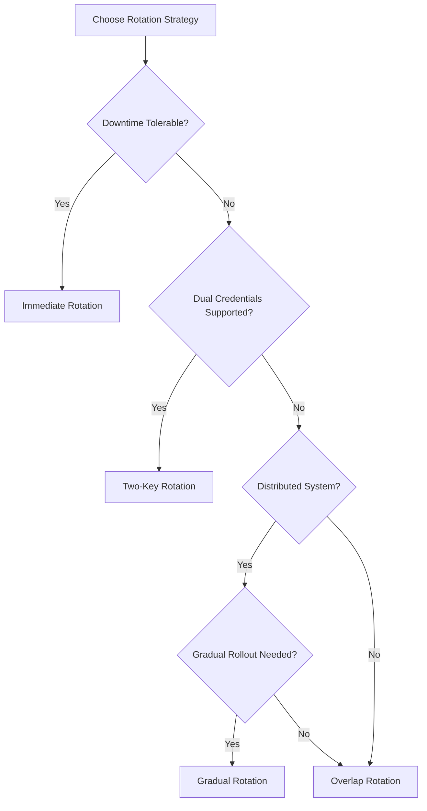

## Overview

Secret rotation strategies determine how old credentials are replaced with new ones. The right strategy depends on your:

- **Availability requirements** - Can you tolerate brief downtime?
- **Service capabilities** - Does the service support multiple valid credentials?
- **Security posture** - How quickly must compromised credentials be invalidated?
- **System complexity** - How many services depend on the secret?

## Available Strategies

### 1. Immediate Rotation

The simplest strategy - immediately replace the old secret with a new one.

```
Timeline:
─────────[old secret]───────X────────[new secret]─────────►
                            ↑
                     Rotation Point
                   (Brief Downtime)
```

**Configuration:**
```yaml
services:
  my-service:
    rotation:
      strategy: immediate
      verification:
        enabled: true
        timeout: 30s
```

**When to Use:**
- Development environments
- Services with automatic retry
- Low-traffic periods (maintenance windows)
- Services that can tolerate brief interruptions

**Pros:**
- ✅ Simple to implement
- ✅ Immediate invalidation of old credentials
- ✅ No credential overlap concerns
- ✅ Works with any service

**Cons:**
- ❌ Brief downtime during rotation
- ❌ Failed connections during transition
- ❌ Not suitable for high-availability systems

**Example Services:**
- Development databases
- Test API keys
- Batch job credentials
- Internal tool passwords

### 2. Two-Key Rotation (Blue-Green)

Maintains two valid credentials simultaneously, enabling zero-downtime rotation.

```
Timeline:
Key 1: ████████████████████████████░░░░░░░░
Key 2:              ██████████████████████████████
       ↑            ↑                  ↑
    Start      Deploy Key 2      Remove Key 1
```

**Configuration:**
```yaml
services:
  postgres-prod:
    rotation:
      strategy: two-key
      key_labels:
        active: "key1"
        pending: "key2"
      transition:
        deploy_delay: 5m
        cleanup_delay: 60m
```

**Process:**
1. Generate new credential (Key 2)
2. Add Key 2 to service (both keys valid)
3. Update secret store with Key 2
4. Wait for propagation
5. Remove Key 1 from service
6. Mark Key 2 as active

**When to Use:**
- Production databases
- High-availability services  
- Services supporting multiple passwords
- Zero-downtime requirements

**Pros:**
- ✅ Zero downtime
- ✅ Safe rollback capability
- ✅ Time for cache expiration
- ✅ Gradual transition

**Cons:**
- ❌ Service must support dual credentials
- ❌ More complex implementation
- ❌ Temporary security exposure (two valid secrets)

**Example Services:**
- AWS IAM (access keys)
- PostgreSQL/MySQL (multiple passwords)
- API services with key rotation APIs
- Stripe API keys

### 3. Overlap Rotation

Creates a time window where both old and new credentials are valid.

```
Timeline:
Old Secret: ███████████████████▒▒▒▒▒▒
New Secret:          ███████████████████████
            ↑        ↑         ↑
         Create   Deploy   Invalidate Old
                 (Overlap Period)
```

**Configuration:**
```yaml
services:
  api-gateway:
    rotation:
      strategy: overlap
      overlap_duration: 24h
      deployment:
        method: gradual
        stages:
          - name: canary
            percentage: 10
            duration: 1h
          - name: production
            percentage: 100
            duration: 23h
```

**When to Use:**
- Distributed systems
- Services with caching
- Multi-region deployments
- Systems with long-running operations

**Pros:**
- ✅ Smooth transition
- ✅ Handles cached credentials
- ✅ Time for global propagation
- ✅ Supports gradual rollout

**Cons:**
- ❌ Extended exposure window
- ❌ Requires careful timing
- ❌ Complex monitoring

**Example Services:**
- CDN authentication tokens
- Distributed cache passwords
- Multi-region databases
- Microservice mesh credentials

### 4. Gradual Rotation (Canary)

Rotates credentials gradually across service instances.

```
Timeline:
10% Fleet:  ████████████░░░░░░░░░░░░░░░░░░
50% Fleet:       █████████████████░░░░░░░░
100% Fleet:           ████████████████████████
             ↑    ↑         ↑           ↑
          Start  10%       50%        100%
```

**Configuration:**
```yaml
services:
  microservice:
    rotation:
      strategy: gradual
      rollout:
        stages:
          - percentage: 10
            duration: 1h
            validation:
              error_rate_threshold: 1%
          - percentage: 50
            duration: 2h
            validation:
              error_rate_threshold: 0.5%
          - percentage: 100
            duration: 1h
        rollback:
          automatic: true
          on_error_rate_above: 2%
```

**When to Use:**
- Large-scale deployments
- Kubernetes services
- Auto-scaling groups
- Risk-averse environments

**Pros:**
- ✅ Early problem detection
- ✅ Automatic rollback
- ✅ Minimal blast radius
- ✅ Performance validation

**Cons:**
- ❌ Complex orchestration
- ❌ Longer total rotation time
- ❌ Requires instance tracking

### 5. Custom Script Strategy

Execute custom rotation logic via external scripts.

```yaml
services:
  custom-service:
    rotation:
      strategy: script
      script:
        path: /opt/rotation/custom-rotate.sh
        timeout: 300s
        environment:
          - name: SERVICE_ENDPOINT
            value: https://api.example.com
        input_format: json
        output_format: json
```

**Script Interface:**
```bash
#!/bin/bash
# Input: JSON via stdin
# Output: JSON via stdout

INPUT=$(cat)
OLD_SECRET=$(echo $INPUT | jq -r '.old_secret')
SERVICE=$(echo $INPUT | jq -r '.service')

# Custom rotation logic
NEW_SECRET=$(generate_secret)
update_service "$SERVICE" "$NEW_SECRET"

# Output result
cat <<EOF
{
  "success": true,
  "new_secret": "$NEW_SECRET",
  "message": "Rotation completed"
}
EOF
```

## Strategy Selection Guide

### Decision Tree



### Strategy Comparison

| Strategy | Downtime | Complexity | Security | Use Case |
|----------|----------|------------|----------|----------|
| Immediate | Yes | Low | High | Development, Testing |
| Two-Key | No | Medium | Medium | Production Databases |
| Overlap | No | Medium | Low | Distributed Systems |
| Gradual | No | High | Medium | Large Deployments |
| Custom | Varies | High | Varies | Special Requirements |

## Implementation Examples

### PostgreSQL with Two-Key Rotation

```yaml
version: 1

services:
  postgres-prod:
    type: postgresql
    host: prod-db.example.com
    port: 5432
    database: production
    admin_username: postgres
    rotation:
      strategy: two-key
      credential_slots:
        - name: primary
          username: app_user_1
        - name: secondary
          username: app_user_2

envs:
  production:
    DB_PASSWORD:
      from:
        store: aws-secrets
        key: prod/db/password
      service: postgres-prod
      rotation:
        ttl: 30d
        notify:
          slack:
            channel: "#database-alerts"
            on: ["failure", "success"]
```

### API Service with Overlap Rotation

```yaml
services:
  stripe-api:
    type: stripe
    rotation:
      strategy: overlap
      overlap_duration: 48h
      verification:
        endpoint: https://api.stripe.com/v1/charges
        method: GET
        expected_status: 200
      notifications:
        before_rotation:
          - webhook: https://ops.example.com/rotation/starting
        after_rotation:
          - webhook: https://ops.example.com/rotation/complete
```

### Kubernetes with Gradual Rotation

```yaml
services:
  k8s-service:
    type: kubernetes-secret
    namespace: production
    rotation:
      strategy: gradual
      target:
        deployment: my-app
        container: api
      rollout:
        stages:
          - replicas: 1
            wait: 5m
            health_check:
              path: /health
              interval: 10s
          - replicas: 50%
            wait: 10m
          - replicas: 100%
            wait: 5m
```

## Advanced Patterns

### Synchronized Rotation

Rotate multiple related secrets together:

```yaml
rotation_groups:
  database_cluster:
    members:
      - postgres-primary
      - postgres-replica-1
      - postgres-replica-2
    strategy: synchronized
    order: sequential  # or parallel
    rollback: all-or-nothing
```

### Conditional Rotation

Rotate based on conditions:

```yaml
services:
  api-service:
    rotation:
      strategy: immediate
      conditions:
        - type: age
          max_age: 90d
        - type: usage
          max_operations: 1000000
        - type: security_score
          min_score: 85
```

### Multi-Stage Rotation

Complex rotation with multiple phases:

```yaml
services:
  complex-service:
    rotation:
      strategy: multi-stage
      stages:
        - name: prepare
          action: create_new_credentials
          verify: check_credential_format
        - name: deploy
          action: update_service
          verify: test_connection
          rollback: revert_to_old
        - name: validate
          action: run_integration_tests
          duration: 30m
        - name: cleanup
          action: revoke_old_credentials
          delay: 24h
```

## Monitoring and Alerts

### Metrics to Track

```yaml
monitoring:
  metrics:
    - name: rotation_duration
      type: histogram
      labels: [service, strategy]
    - name: rotation_success_rate
      type: gauge
      labels: [service]
    - name: failed_rotations
      type: counter
      labels: [service, error_type]
    - name: time_since_rotation
      type: gauge
      labels: [service]
```

### Alert Configuration

```yaml
alerts:
  - name: rotation_failed
    condition: failed_rotations > 0
    severity: critical
    notify:
      - pagerduty
      - slack
  
  - name: rotation_overdue
    condition: time_since_rotation > ttl * 1.1
    severity: warning
    notify:
      - email
      - slack
```

## Best Practices

### 1. Test Strategy Selection

Always test your chosen strategy in non-production:

```bash
# Test rotation strategy
dsops secrets rotate --env staging --key DB_PASSWORD --dry-run

# Validate strategy behavior
dsops rotation history --env staging --limit 10
```

### 2. Document Strategy Choices

```yaml
services:
  critical-service:
    rotation:
      strategy: two-key
      # IMPORTANT: This service requires two-key strategy because:
      # 1. It's a critical production service
      # 2. Supports multiple passwords via ALTER USER
      # 3. Has 99.99% uptime SLA
      documentation_url: https://wiki.example.com/rotation-decisions
```

### 3. Plan for Failure

Every strategy should handle failures gracefully:

```yaml
rotation:
  strategy: overlap
  failure_handling:
    max_retries: 3
    retry_delay: exponential
    rollback:
      enabled: true
      verification_required: true
    notifications:
      on_failure:
        - slack: "#incidents"
        - pagerduty: "database-team"
```

### 4. Consider Dependencies

Map out service dependencies before choosing strategy:

```yaml
# Document dependencies
services:
  database:
    rotation:
      strategy: two-key
      dependents:
        - api-service
        - background-jobs
        - reporting-service
      coordination:
        method: "rolling"
        delay_between: 5m
```

## Troubleshooting Strategies

### Strategy-Specific Issues

**Immediate Rotation**
- Connection errors during rotation → Implement retry logic
- Cached credentials → Reduce cache TTL before rotation

**Two-Key Rotation**
- Service doesn't support dual keys → Consider overlap strategy
- Key cleanup fails → Manual intervention required

**Overlap Rotation**
- Old credentials used beyond window → Extend overlap duration
- Security compliance concerns → Reduce overlap window

**Gradual Rotation**
- Inconsistent state across instances → Implement instance tracking
- Rollback complexity → Automate rollback procedures

## Related Documentation

- [Rotation Architecture](/rotation/architecture/) - How rotation works
- [Rotation Configuration](/rotation/configuration/) - Configuration reference
- [Rotation Commands](/rotation/commands/) - CLI usage
- [Provider Capabilities](/providers/) - Provider rotation support